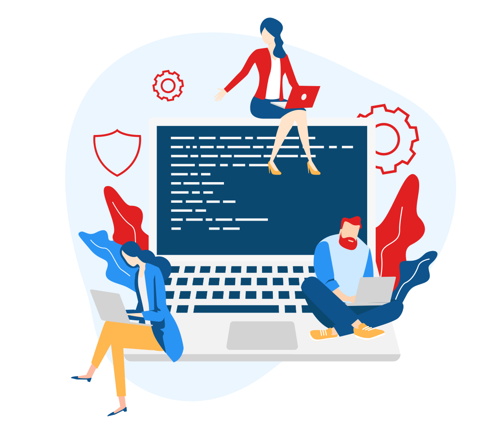

OSL, a student-run community with over 20+ members from Vidyavardhaka College of Engineering, Mysuru, over the last 2 years, has helped 100+ passionate students to transform into successful & innovative engineers who today work across the world in Fortune 500 Companies loving what they do.

<h1 style="text-align: center">Who we are?</h1>

Open Source Lab (also known as OSL ) is a community of passionate college students, who have come together for the cause of promoting and contributing to Free and Open Source.
The club envisions to make its members competent to become the leaders of the future with excellence in technical, creative, and intrapersonal skills.

Founded in 2017, the club over the years has been renowned as one of the leading student clubs in India, with about 500 active members. It has so far produced a GSoCer, and multiple Grand Finalist teams in SIH. The club is run by the students themselves, with the help of research scholars, alumni, and faculties.

<h1 style="text-align: center">What We Do?</h1>

The club operates by the principle of mentorship and family, where the senior members of the club individually mentor the juniors.
The members contribute to Open Source projects of their own interests and also conduct workshops and technical fests to encourage others to work on open source technologies.

The club has specialised teams internally such as one focused on Android, Blockchain, IoT,etc..
We believe in the holistic development of its members, and the members besides seeking excellence in technical skills, also engage in talks, debates, sports, cultural activities, yoga sessions etc.

<h1 style="text-align: center">What we have achieved?</h1>

The club has become one of the forerunners in promoting, and contributing to open source in the country, introducing over a hundred enthusiasts every year to the world of Open source through the various activities it conducts.

The club has produced 12 teams who have made it through SIH Grand Finale over the last 3 year. The members have been actively taking part in international conferences, meetups, hackathons, as well as delivering talks and presenting projects at various events.
Majority of the club alumni have been placed in core computer science companies, not to mention its active members also get selected for summer schools at global universities, and paid internships at top companies.
