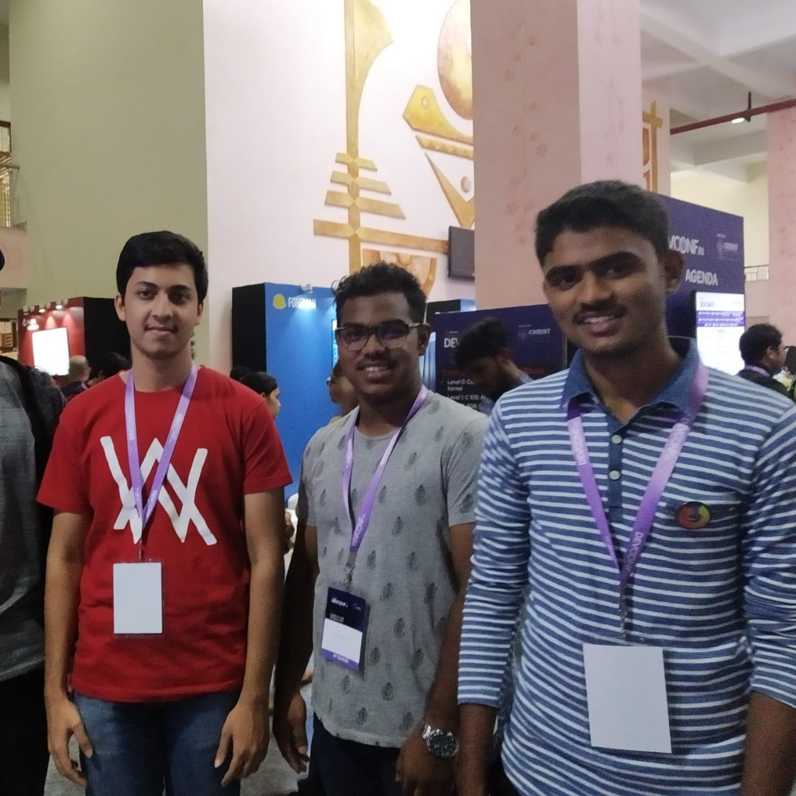

The two day conference held at Bangalore began sharp at 10 am and closed at 6pm in the evening. The first day began with a keynote speech and then progressed on with the days activities. Four students from OSL volenteered for this conference and represented Mozilla throughout the same. The students worked on Common Voice and Localisation and demonstrated the same at this conference,the participants got crowds to participate in huge numbers for their activities and demonstrations. After receiving active participation, the students began interacting with the crowd and learning further on peoples contribution to the conference and to the world of open source as well. Day 1 was successfully wrapped by 4 pm.

The second day once again began with another heartwarming opening keynote speech that focused on the main purposes of the conference and the goals achieved throughout day 1. Our students were soon once again faced with large crowds that really tested their people handling skills! Nonetheless they enjoyed handling and interacting with the crowd per usual. The second day was similar to the first and included seminars and other talks. The students were asked to stop at 4 pm in the evening and called for a group photo with all the volunteers. In fact our students also met other Mozilla volunteers and discussed their plans for upcoming Mozilla events.

According to our students, both days were very interesting and they enjoyed a lot. They had the chance to speak to people from different backgrounds which included students and professionals. They even met a lot of Mozillians and Members from Red Hat and other open source community.
