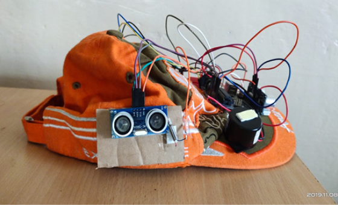
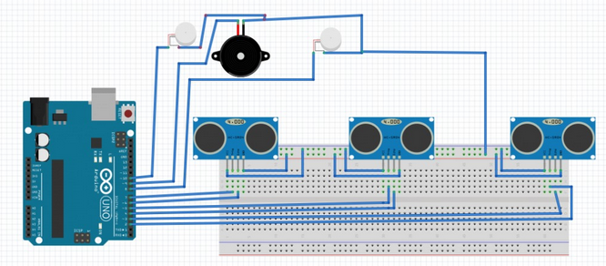

The Arduino controller and ultrasonic sensor were studied and the HcSR-04 ultrasonic sensor was selected, as the controlling result is satisfying for its use in the human welfare system being developed. It is used to sense the substances, humans or even the obstacles and avoid them. On successful implementation, ultrasonic sensors algorithm was successfully carried out too with minimal errors, by coding the algorithm in Arduino software. The application of our project can be implemented to help all the visually impaired persons and create a better and confident life.

[row][col]

## Instructions

-   Make the connections as per the circuit diagram
-   Place all the 3 ultrasonic sensors in the 3 different directions (front, left, right )
-   Make sure that all the connections are tight
-   Download the Arduino software from www.arduino.cc/en/main/software
-   Make a connection between your pc and Arduino
-   Copy the code to the Arduino software
-   Upload the code to the Arduino board

[/col][/row]

[row][col]

The ultrasonic sensors detect objects that 20 meters. The whole sensing vision by the ultrasonic sensor is 180 degrees. The sensors cannot detect objects that are behind the cap. If used in a rough manner there might be a probability of short circuit. You can change the timings of beeping according to the distance // upgrade. Can add another ultrasonic sensor behind the cap // upgrade.

[/col][/row]
