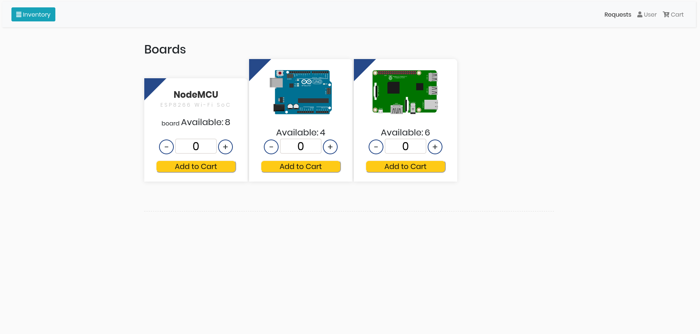

A website which keeps track of what is already there in the inventory and what is required. A website where people can request items which will go for the approval process.

[row][col]

The application was created to manage inventory in OSL VVCE. It is a web-based Inventory System, that will allow us to keep track of the components existing that we have.

[/col][/row]
